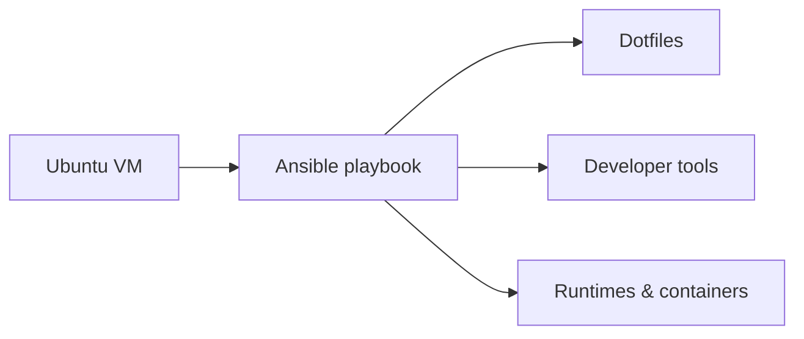

<h1 align="center">Workstation</h1>

<p align="center">
  Reproducible Ubuntu development environment managed with Ansible.<br>
  Configures an Ubuntu development VM across three areas: dotfiles, developer
  tools, and runtimes &amp; containers.
</p>

<p align="center">
  <a href="https://github.com/alikayar/workstation/actions/workflows/ci.yml">
    
  </a>
</p>

## Design goals

- **Reproducible:** workstation configuration lives in version control.
- **Idempotent:** roles are designed to be safe to run again.
- **Isolated:** development tools run inside an Ubuntu VM.
- **Modular:** Ansible roles can be applied independently with tags.

## Architecture



## What it manages

- **Dotfiles:** Zsh, Git, Starship, and Codex CLI configuration.
- **Developer tools:** GitHub CLI, Delta, bat, fd, ripgrep, jq, and yq.
- **Runtimes & containers:** language runtimes via mise; Docker Engine, Compose,
  and Buildx.

## Quick start

On an Ubuntu VM with internet access and `sudo`, run from the repository root:

```bash
sudo apt-get update
sudo apt-get install --yes ansible-core python3-debian
cp ansible/host_vars/localhost.example.yml ansible/host_vars/localhost.yml
```

Edit `ansible/host_vars/localhost.yml` and set your Git identity.

Optional: preview changes before applying them:

```bash
ansible-playbook ansible/site.yml --check --diff --ask-become-pass
```

Apply the configuration:

```bash
ansible-playbook ansible/site.yml --ask-become-pass
```

## Documentation

See the [setup guide](docs/getting-started.md), [tool inventory](docs/tools.md),
and design notes for [shell](docs/shell.md), [mise](docs/mise.md), and
[Codex](docs/codex.md). This personal workstation configuration is shared as a
reference under the [MIT License](LICENSE).
